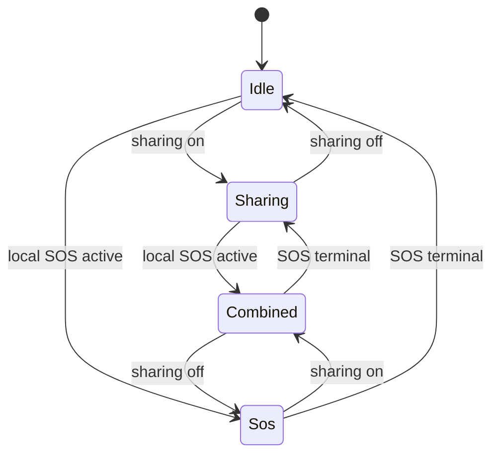

# SDK integration guide

This guide is the public starting point for host applications. It describes
the Android/iOS Flutter plugin at the current repository head. Detailed SOS
semantics live in
[Authoritative SOS lifecycle](SOS_LIFECYCLE_ARCHITECTURE_2026.md), and the
complete public surface is indexed in
[Public API reference](PUBLIC_API_REFERENCE.md).

## Scope and ownership

EIXAM Connect provides typed SOS, device, telemetry, location, protection,
notification, relay, profile, history, and diagnostics contracts.

| Concern | SDK owns | Host app owns |
| --- | --- | --- |
| Bootstrap | Environment resolution, transport construction, local restoration | Selecting the environment and supplying localized notification text |
| Authentication | Consuming and storing a signed `EixamSession` | Authenticating the user and obtaining the signed identity from a trusted partner service |
| SOS | Lifecycle, generation, countdown, transport selection, cancellation, terminal classification, progress correlation | User intent, rendering typed state, navigation, and localized copy |
| Device | BLE protocol, preferred-device state, connection, command readiness, reconnect | Pair/connect UX and permission disclosure |
| Location | Acquisition, latest phone position, stream, SOS ownership, platform context arbitration | Permission UX and rendering nullable location |
| Diagnostics | Structured state, redaction, bounded debug opt-ins | Support consent, safe collection, and secure transfer |

The runtime plugin declared by `eixam_connect_flutter` supports Android and
iOS. `eixam_connect_core` is pure Dart, but that does not make native runtime
features available on desktop or web.

The monorepo packages are:

- `eixam_connect_core`: public contracts, entities, errors, and state models;
- `eixam_connect_flutter`: Android/iOS runtime and partner-facing entry point;
- `eixam_connect_ui`: reusable Flutter UI helpers.

## Add the dependency

Packages are private (`publish_to: none`). A host can pin all packages to one
reviewed Git commit or use repository-relative path overrides for local work.
Keep the three packages on the same SDK revision.

Pinned Git dependency shape:

```yaml
dependencies:
  eixam_connect_core:
    git:
      url: https://github.com/eixam-tech/eixam-sdk-flutter.git
      ref: edbfd2328f759ee94908d8d72c201a26cd69670e
      path: packages/eixam_connect_core
  eixam_connect_flutter:
    git:
      url: https://github.com/eixam-tech/eixam-sdk-flutter.git
      ref: edbfd2328f759ee94908d8d72c201a26cd69670e
      path: packages/eixam_connect_flutter
```

For local SDK/app iteration, use an untracked `pubspec_overrides.yaml`:

```yaml
dependency_overrides:
  eixam_connect_core:
    path: ../eixam-sdk-flutter/packages/eixam_connect_core
  eixam_connect_flutter:
    path: ../eixam-sdk-flutter/packages/eixam_connect_flutter
```

Then run `flutter pub get` in the host app.

## Initialize and attach a session

Importing the Flutter package registers the bootstrapper used by
`EixamConnectSdk.bootstrap`.

```dart
import 'package:eixam_connect_flutter/eixam_connect_flutter.dart';

const notificationTexts = EixamNotificationTexts(
  protectionActiveTitle: 'Protection active',
  protectionActiveBody: 'Your connected device is being monitored.',
  protectionModeTitle: 'Protection mode',
  protectionModeBody: 'Protection mode is running in the background.',
  protectionModeChannelName: 'Protection mode',
  protectionModeChannelDescription: 'Keeps device protection active.',
  protectionSosChannelName: 'SOS alerts',
  protectionSosChannelDescription: 'Shows SOS lifecycle alerts.',
  protectionPreSosTitle: 'SOS countdown',
  protectionPreSosBody: 'An SOS alert is about to be sent.',
  protectionSosActiveTitle: 'SOS active',
  protectionSosActiveBody: 'Your SOS alert is being handled.',
  protectionSosResolvedTitle: 'SOS resolved',
  protectionSosResolvedBody: 'Your SOS alert has been resolved.',
);

final signedSession = EixamSession.signed(
  appId: 'partner-app',
  externalUserId: 'partner-user',
  userHash: 'signed-value-returned-by-partner-service',
);

final sdk = await EixamConnectSdk.bootstrap(
  EixamBootstrapConfig(
    appId: signedSession.appId,
    environment: EixamEnvironment.staging,
    notificationTexts: notificationTexts,
    initialSession: signedSession,
  ),
);
```

The host must obtain `appId`, `externalUserId`, and `userHash` from its trusted
backend. The mobile app must not compute the signing value. An initial session
is optional, but its `appId` must match the bootstrap `appId`. A session can
also be attached later with `setSession`; call `clearSession` during logout.

`production`, `staging`, and `sandbox` resolve fixed SDK endpoints.
`EixamEnvironment.custom` requires `EixamCustomEndpoints`; custom endpoints are
rejected for fixed environments. Insecure local endpoints require both a debug
build and `allowInsecureLocalEndpoints: true`. Do not use custom or staging
configuration as production evidence.

Bootstrap creates and initializes the runtime, but does not request
permissions, scan, pair, connect, or trigger SOS.

## Device integration

The normal host flow is:

1. Request or verify Bluetooth permission with the permission APIs.
2. Use `scanBleDevices` to present nearby candidates.
3. Call `connectDevice(pairingCode: ...)`.
4. Observe `deviceStatusStream`.
5. Check `getDeviceCommandChannelStatus` or
   `watchDeviceCommandChannelStatus` before device commands.
6. Read `preferredDevice` and use `bootstrapPreferredDeviceReconnect`,
   `startPreferredDeviceReconnectMonitor`, or `reconnectPreferredDevice` for
   typed reconnect behavior.

`connectDevice` is the current public API; `pairDevice`, `unpairDevice`, and
`watchDeviceStatus` are deprecated compatibility members. A BLE link does not
by itself prove command readiness. Service discovery and the typed command
channel decide whether commands can be sent.

Reconnect outcomes are returned as `PreferredDeviceReconnectResult`. Bluetooth
off, missing permission, no known device, an in-flight attempt, and connection
failure remain distinct typed outcomes. Hosts should render those outcomes and
must not create a second reconnect loop around the SDK monitor.

## Backend and realtime transport

The current production runtime wiring uses authenticated HTTP for identity,
profile, device, contact, history, cancellation, and related request/response
operations, and MQTT for operational SOS/telemetry and realtime lifecycle
events. Treat MQTT as the current implementation, not an immutable public
backend protocol.

An already-connected MQTT socket is not an app-origin SOS prerequisite. The
publish path establishes the connection from the current signed session when
needed. After an unplanned disconnect, the realtime client reconnects while a
session is attached unless it was manually stopped. Hosts observe
`watchRealtimeConnectionState`; they do not reconnect or republish the same SOS
on their own.

Relay publication is SDK-owned and deduplicated. A relay-origin
unprocessable/terminal response is recorded as terminal for that handoff and
is not retried indefinitely.

## SOS integration

Use `getSosLifecycle` for the initial snapshot and subscribe to
`sosLifecycleStream`. Use `getSosCapability` plus `watchSosCapability` to
render action readiness. Trigger and cancel with
`triggerSosAuthoritatively` and `cancelSosAuthoritatively`.

`startPreSos`, `confirmPreSos`, `cancelPreSos`, and `watchPreSosStatus` expose
the SDK-owned countdown flow. A host timer may render the returned deadline,
but it is not lifecycle authority.

Use `getCurrentSosIncidentProgress` and
`currentSosIncidentProgressStream` for backend/contact progress. Do not infer
active SOS from `SosState.sending`, history, diagnostics, or string values.

## Location architecture

The SDK has one acquisition owner. Host apps consume:

- `getResolvedLocationForEmergencyContext`;
- `watchResolvedLocation`;
- `getCurrentPosition` and `watchPositions` where raw tracking contracts are
  appropriate.

Location is nullable and never an SOS transport prerequisite. The SDK retains
the latest accepted phone position and resolves it with applicable device
evidence. Host apps must not start a second location manager for SOS.

Background location is represented by independent `sharing`, `dmp`, and `sos`
contexts. The effective priority is `sos`, then `dmp`, then `sharing`.
Removing `sos` after a confirmed terminal lifecycle preserves `sharing` and
`dmp` when either remains active.



`Combined` is a presentation name for more than one active context; the public
effective mode remains the highest-priority `BackgroundLocationMode`.

## iOS host requirements

The native background-location service verifies these host declarations:

- non-empty `NSLocationWhenInUseUsageDescription`;
- non-empty `NSLocationAlwaysAndWhenInUseUsageDescription`;
- `location` in `UIBackgroundModes` for background operation.

Bluetooth hosts also require the applicable Bluetooth usage descriptions.
When-In-Use authorization supports foreground use. Active background location
requires Always authorization; the SDK reports a typed runtime error when the
host declaration, system service, or authorization is insufficient.

The iOS bridge owns one process-wide `CLLocationManager`, restores persisted
control state after a normal relaunch, and uses delegate callbacks for cached
authorization state. The global service-enabled query is performed off the
main queue and its result is cached; sample delivery does not perform a
blocking global service query.

## Android host requirements

The plugin manifest contributes legacy Bluetooth permissions, Android 12+
`BLUETOOTH_SCAN`/`BLUETOOTH_CONNECT`, notifications, foreground-service
permissions, and foreground location permissions. A host using background
location must declare `ACCESS_BACKGROUND_LOCATION`, present the required
disclosure, and request permissions through the typed SDK preflight/request
flow.

Android SOS and sharing requests use one tracking-owner arbiter. Removing the
SOS owner does not stop acquisition while another owner still requires it.
Foreground-service and notification readiness remain platform/version
dependent and are exposed through typed permission/protection status.

## Diagnostics and privacy

`getOperationalDiagnostics` and `watchOperationalDiagnostics` are for support,
not control flow. Normal app behavior must use typed lifecycle, capability,
device, permission, and progress state.

Release-safe diagnostics pass through central redaction. Identifiers,
coordinates, credentials, headers, topics, payload bodies, and raw BLE data
must not be emitted. Safe events use booleans, counts, bounded categories, and
typed reason codes. The redactor does not replace identifiers with persistent
hashes.

Diagnostic opt-ins are compile-time and debug-only:

- `EIXAM_VERBOSE_DEVICE_DIAGNOSTICS=true` enables additional device events;
- `EIXAM_VERBOSE_LOCATION_DIAGNOSTICS=true` enables sensitive location
  troubleshooting output;
- `EIXAM_SOS_LOCATION_TRACE=true` enables privacy-safe SOS/location state
  transitions.

All default to false. MQTT protocol logging additionally requires SDK
`enableLogging`, stays debug-only, and does not enable payload logging.
Profile and release builds do not enable the debug-only traces.

For support collection, reproduce with synthetic data, enable only the
smallest necessary debug flag, review the output for personal data, remove
unrelated lines, and transfer it through the approved support channel. Never
attach production tokens, full identifiers, coordinates, contacts, raw
packets, or complete broker topics.

## Troubleshooting

| Symptom | Verify | Correct action |
| --- | --- | --- |
| Bootstrapper not registered | The host imports `eixam_connect_flutter.dart` | Import the partner entry point before calling `EixamConnectSdk.bootstrap` |
| SDK not initialized or authenticated | Bootstrap completed and `getCurrentSession` is non-null | Attach the host-signed session; do not compute a signature in the app |
| Device not connected | Permission state, `deviceStatusStream`, preferred device | Request permission through the host UX, then connect or use typed reconnect |
| Command unavailable | `watchDeviceCommandChannelStatus` | Wait for service discovery/readiness; do not infer readiness from connection alone |
| Reconnect does not run | `PreferredDeviceReconnectResult` and preferred device | Handle the typed reason; avoid a competing app reconnect loop |
| Location unavailable | Permission snapshot, system services, nullable resolved location | Continue SOS with degraded context; prompt only through an explicit host flow |
| iOS host configuration missing | Info.plist descriptions and `UIBackgroundModes` | Add the confirmed declarations and rebuild the host |
| Countdown is visible but not active | `SosLifecycleStage` and revision | Keep rendering `arming`/`activating`; do not treat countdown or `sending` as proof |
| Progress is absent | Backend confirmation, progress stream, incident handoff | Keep pending UI; do not correlate from log text or guessed IDs |
| Cancellation remains pending | Cancellation outcome and phase | Keep the active surface until a confirmed terminal snapshot |
| A second SOS is unavailable | Latest capability revision after terminal state | Wait for the SDK capability update; do not reset lifecycle locally |
| External SOS appears | `externalOnly`, actionability, display surface | Keep it in history and do not expose local cancel/navigation |
| Support needs diagnostics | Operational diagnostics and minimal debug opt-in | Collect redacted, synthetic, narrowly scoped output only |

## Validation status language

The behavior described here is implemented in the current source and tests.
The current branch flows were physically and backend validated against
staging. Production endpoints and release tooling are configurable, but this
documentation is not evidence of a production backend deployment, store
acceptance, or production mobile release.
