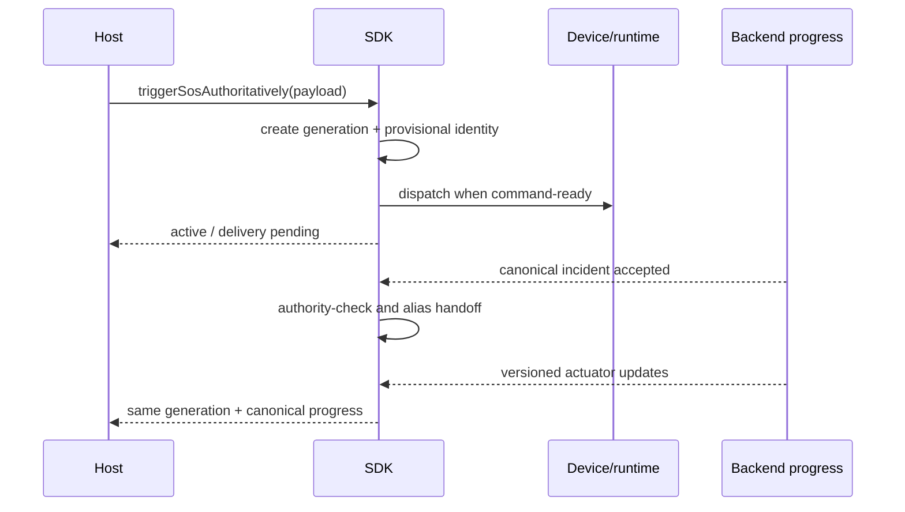

# Authoritative SOS Lifecycle (2026)

## Decision

The Flutter SDK is the single owner of SOS lifecycle truth. Applications render
and navigate from `SosLifecycleSnapshot`; they do not reconstruct ownership
from history, timers, device summaries, routes, or preferences.

## Public model

`SosLifecycleSnapshot` exposes `idle`, `arming`, `activating`, `active`,
`cancelling`, `cancelled`, `resolved`, `activationFailed`,
`cancellationFailed`, and `recoveryRequired`. It includes the lifecycle ID and
monotonic generation, origin, actionability and display classification,
incident/device/node identity, activation and observation timestamps,
cancellation phase, recovery status, and a non-sensitive failure code.

Typed operations return `SosActivationResult` (`activated`,
`alreadyActiveRecovered`, `alreadyActiveUnmatched`, `failed`) and
`SosCancellationResult` (`cancelled`, `pendingConfirmation`,
`alreadyTerminal`, `failed`). Existing SOS methods and streams remain available
for compatibility.

```text
idle -> arming -> activating -> active -> cancelling -> cancelled/resolved
                    |             |           |
                    |             |           +-> cancellationFailed -> retry
                    |             +-> recoveryRequired -> active/cancelling
                    +-> activationFailed
                    +-> recoveryRequired (already active, proof unresolved)
terminal -> a new lifecycle ID and generation
```

## Source-of-truth rules

- Arming is accepted SDK countdown state, but is not persisted as proof.
- Active local ownership requires successful activation, a local incident, or
  an authoritative active observation from the connected/registered device.
- Backend history is never sufficient to create local actionability.
- A temporary unavailable runtime or BLE disconnect does not imply terminal
  state.
- Only an authoritative cancellation/resolution boundary clears provenance.
- Late observations older than the activation boundary, or for another node,
  cannot close the current generation.

## Secure provenance

`AuthoritativeSosLifecycleController` uses the platform-backed
`SecureKeyValueStore`. Provenance is account-scoped and contains only the
minimum generation, lifecycle, origin, identity, timing, and pending
cancellation evidence required for recovery. Storage keys and native storage
details are private implementation details, not part of the integration
contract.

It never stores coordinates, contacts, full incidents or payloads, BLE packets,
tokens, PSKs, voice data, or location history. A record is written only after
local ownership proof exists. Logout detaches local state and local-data/account
deletion deletes the record. A mismatched account cannot read or adopt it.
Unreadable records produce non-actionable `recoveryRequired`, never cancelled.

## Generation identity

The SDK creates `sos:<node-or-device>:<UTC-microseconds>:<monotonic-generation>`.
The timestamp plus monotonic component prevents reused firmware `packetId=0`
from merging consecutive incidents. A confirmed terminal boundary permits the
next generation; duplicate observations enrich the current generation without
creating another one.

## Activation and already-active recovery

`triggerSosAuthoritatively` publishes `activating`, invokes the existing
activation transports, and publishes/persists `active` only after proof.
`E_SOS_ALREADY_ACTIVE` is handled inside the SDK:

1. Current or persisted matching local ownership returns
   `alreadyActiveRecovered`.
2. An authoritatively active matching local device restores ownership and
   returns `alreadyActiveRecovered`.
3. Without trustworthy proof, the SDK publishes `recoveryRequired` and returns
   `alreadyActiveUnmatched`.

The unmatched case is not success and never becomes cancelled. Consumers do
not parse exception strings.

## Cancellation

`cancelSosAuthoritatively` publishes `cancelling` before invoking the existing
device/backend cancellation path. The lifecycle records `requested`,
`transportAccepted`, `deviceConfirmed`, `backendConfirmed`, or `fullyResolved`.
An existing backend-confirmed cancellation is the strongest terminal evidence
currently available and permits `cancelled` plus secure-record deletion. A
device-only acceptance remains `cancelling/pendingConfirmation` until stronger
terminal evidence arrives. Failure publishes `cancellationFailed`, retains
provenance, remains locally actionable, and permits retry. Repeated terminal
cancellation is idempotent.

## Process and BLE recovery

Initialization and session attachment restore same-account provenance before
publishing lifecycle state. An active record initially becomes
`recoveryRequired/reconciling`; a pending cancellation restores as
`cancelling`. Current incident and device observations then enrich the same
generation. BLE disconnect does not clear provenance, while reconnect can add
device evidence without duplicating the lifecycle.

## App integration contract

Applications subscribe to `sosLifecycleStream`, call
`getSosLifecycle()` for the initial snapshot, and use the typed activation and
cancellation methods. The active surface is eligible only when SDK truth is
local-actionable and not history-only. `cancelling`, `cancellationFailed`, and
`recoveryRequired` remain visible with truthful status. Only explicit SDK
`cancelled` or `resolved` closes the active surface.

## SOS source semantics

| Source | Lifecycle origin | Local active surface | Phone location | Local cancellation |
| --- | --- | --- | --- | --- |
| App-origin | `localApp` | Yes | SDK resolves latest accepted phone/device evidence | Through authoritative cancellation |
| Connected local device | `connectedLocalDevice` or `registeredLocalDevice` | Yes | SDK SOS context supplies phone updates while active | App command when capable; physical TAG terminal events are authoritative |
| External backend incident | `externalBackend` | History-only unless matched to local provenance | Display-only incident evidence | No local cancellation |
| Remote relay | `remoteRelay` | History-only | Remote packet location is not phone acquisition | Relay handoff only; no local active control |

There is one owner per active local SOS generation. A connected-device
`preConfirm` and the later active/backend observations enrich that generation;
they do not create competing owners. Remote/external observations never adopt
local ownership without the explicit provenance checks described above.

## Incident identity and progress handoff

An app or connected-device activation can begin with a local provisional
incident identity. A connected device also has runtime/node evidence used only
for ownership correlation. Backend processing later supplies the canonical
incident identity. The repository preserves the provisional alias, adopts the
canonical identity after an authority-checked handoff, and applies buffered
actuator updates to the same logical generation.

Progress starts with backend delivery pending, becomes confirmed only after
backend evidence, and adds emergency-contact state from versioned actuator
snapshots. Older or duplicate snapshot versions are ignored. Progress streams
are broadcast and deduplicate equivalent state, so multiple subscribers
observe one repository-owned lifecycle. Terminal incident state emits terminal
progress and clears buffered correlation state.

Diagnostics expose only whether provisional/canonical/correlation values are
present and which typed category was selected. They do not emit the values or
derive stable hashes from them.



## Connected-device sequence

```mermaid
sequenceDiagram
  participant Tag as Connected TAG
  participant SDK
  participant Host
  participant Service as Backend
  Tag-->>SDK: preConfirm
  SDK-->>Host: arming with stable deadline
  Tag-->>SDK: active
  SDK-->>Host: active immediately
  SDK->>Service: publish once for the owned generation
  Service-->>SDK: canonical incident/progress
  SDK-->>Host: enrich active generation
  Tag-->>SDK: terminal cancel
  SDK-->>Host: cancelled; next generation may arm
```

Duplicate packets preserve the first accepted countdown deadline. Late
countdown packets cannot replace active state. Stale revisions and prior
generation terminal packets are ignored.

## SOS location ownership

The SDK reduces authoritative lifecycle revisions to
activate/deactivate/retain location effects. Locally actionable `active`,
`cancelling`, `cancellationFailed`, and `recoveryRequired` retain SOS
ownership. Confirmed `cancelled`/`resolved` remove it for the matching
generation. External-only and ambiguous observations retain current ownership
rather than changing it.

The platform sink changes only the `sos` owner. On iOS, the native service
keeps the independent `sharing`, `dmp`, and `sos` context set on its single
manager. On Android, the tracking-owner arbiter applies the same coexistence
rule. This is why SOS cancellation returns to sharing when Profile sharing is
still active, rather than stopping acquisition globally.

## Backward compatibility and privacy

Legacy methods are retained and the SDK continues adapting device/current SOS
streams. New fields are intentionally limited to lifecycle decisions. Logs
should use reason codes and booleans; no new coordinates, hardware addresses,
user IDs, raw packets, or full incident IDs are required by this design.

## Multi-path activation capability

Lifecycle and readiness are separate SDK contracts. `SosLifecycleSnapshot`
answers what is happening to the current SOS generation;
`SosCapabilitySnapshot` answers which existing transport can perform the next
action. An idle lifecycle is therefore not required to be `localActionable` in
order for a new app SOS to be available.

The capability aggregates independent paths:

- `appBackend`: an authenticated session plus the existing HTTP/MQTT SOS
  repository and a lifecycle that permits activation;
- `connectedDevice`: a connected device with the SOS command channel ready;
- `restoredActiveLifecycle`: persisted local proof for recovery/cancellation;
- `physicalDevice`: a typed path identifier reserved for device-originated
  observation; it is not claimed as an app-triggerable route while disconnected.

Global activation availability is exactly
`canTriggerAppSos || canTriggerDeviceSos`. Device registration, BLE,
command-channel discovery, tracking, background-location permission and
telemetry are not prerequisites of `appBackend`. Device failure only removes
the connected-device path and is reported as typed degradation.

`getSosCapability`, `watchSosCapability`, and `retrySosCapability` are public.
The stream recomputes on SDK transport/device diagnostics and authoritative
lifecycle changes. Blocking and degradation are enums; no UI copy or raw
runtime strings cross the SDK boundary. `SosActivationResult` also reports the
selected path and the paths actually used, derived from the existing delivery
channel.

## Transport selection, location, and cancellation

The existing `_activatePublicSos` orchestration remains authoritative. It
attempts the connected-device command when ready, independently publishes via
the existing `SosRepository` HTTP/MQTT path, and accepts backend-only,
device-only, or combined success without duplicating the lifecycle. App-only
success immediately confirms and persists the same authoritative local
generation. A later reconnect enriches that generation.

Emergency location resolution prefers current device evidence, then phone
location and permitted cached evidence. `positionSnapshot` is nullable in the
existing repository/API contract, so unavailable location is a typed degraded
reason and never blocks activation. No urgent activation requests background
location permission.

Cancellation uses the same independent transport aggregation. The SDK tries a
device close only when that command path is usable and always attempts the
existing backend cancellation. Thus a backend-backed app SOS remains
cancellable without BLE. Backend confirmation permits terminal `cancelled`;
device-only acceptance remains pending until authoritative terminal criteria
are satisfied.

## Physical validation matrix

- Signed-in app, no registered or connected device: app activation/cancel.
- Registered device disconnected and BLE disabled: app activation/cancel.
- Connected device with and without command discovery: combined versus app-only.
- Location granted, denied, services disabled, and no fix: activation remains
  transport-driven and coordinate handling remains truthful.
- Backend unavailable with command-ready device: device-only pending behavior.
- Reconnect during app-only active SOS: same generation, no duplicate incident.
- Relaunch during app-only active/cancelling SOS: secure lifecycle recovery.

## SDK-first capability regression correction (2026-07)

The false field was `appTransportReady=false`. For an
`MqttOperationalSosRepository`, capability evaluation treated the current
realtime socket state as a mandatory activation prerequisite. A disconnected
or still-connecting MQTT state therefore produced `noActivationPath` whenever
the optional BLE path was also unavailable.

That source was stale with respect to the real trigger contract.
`MqttOperationalSosRepository.triggerSos` delegates to
`MqttRealtimeClient.publishOperationalSos`, which authenticates from the SDK
session and calls its connection establishment path before publishing. The app
path prerequisites are therefore an initialized SDK, an authenticated session,
a configured operational SOS repository, and a lifecycle that permits a new
activation. An already-connected MQTT socket is not required. HTTP remains the
backend cancellation path where configured; no new endpoint or fallback was
introduced.

Capability continues to recompute from initialization/session, realtime,
device diagnostics, command-path and lifecycle events. Before initialization,
the typed result is `initializing` with `transient=true`. After initialization
and authentication, Bluetooth-off or disconnected-device state removes only
the device path; app-only activation remains ready. Each meaningful transition
emits one debug-only, privacy-safe `SOS_CAPABILITY_EVAL` line containing only
the source, readiness booleans, typed blocking reason and selected path. It
contains no identity, incident, location, endpoint, token or packet data.

## Authoritative already-active ordering correction (2026-07-17)

App-originated activation now publishes `arming -> activating` and keeps the
typed lifecycle at `activating` while `SosRepository.triggerSos` is pending.
Only repository acceptance or SDK-owned reconciliation of the account-scoped
current-active endpoint may publish `active`. The legacy `SosState.sending`
surface remains transport progress, not activation proof.

For `E_SOS_ALREADY_ACTIVE`, the SDK performs three bounded current-active
reads. It matches lifecycle/cycle correlation, persisted backend identity,
proven device identity, or explicit current app provenance. It never queries
history for promotion. A match returns `alreadyActiveRecovered`, retains the
generation and publishes actionable `active`. An authoritative current active
incident that cannot be matched returns `alreadyActiveUnmatched` and publishes
`recoveryRequired`; a new activation remains blocked. Cancellation is exposed
only when the lifecycle contains an authoritative backend or local incident
identity and an appropriate transport is available.

Every lifecycle publication receives a monotonic `revision`. Capability is
built from one captured lifecycle snapshot and carries that same revision.
Consumers merge lifecycle and capability halves at an equal revision in either
arrival order and reject snapshots older than the greatest accepted SOS
revision. This prevents active/recovery state from being combined with an
older ready capability (and prevents the reverse stale-idle merge). Terminal
presentation and readiness for a subsequent activation remain independent.

## App-origin countdown bridge classification (2026-07-17)

`SOS_APP_ORIGIN_ACTIVE_BRIDGE_REGISTERED` is diagnostic output from the legacy
short-lived public-state bridge that retained an accepted `SosState` while a
stale repository `idle` could arrive. No SDK or app control flow consumes the
marker. The authoritative lifecycle and its monotonic revision are the direct
invariant; the marker is not lifecycle proof.

The marker-only regression exposed a genuine gap rather than a need to restore
the diagnostic: automatic app-origin countdown completion published legacy
`sent` after transport acceptance but left `SosLifecycleSnapshot` at `arming`.
Countdown settlement now publishes `activating` before `confirmPreSos`, then
publishes `active` with the accepted incident and the existing lifecycle ID and
generation. Failure publishes `activationFailed`; unresolved already-active
settlement publishes `recoveryRequired`. A stale legacy `idle` does not change
the active lifecycle or its revision. The regression asserts those typed
states, provenance, identity, generation and revision directly instead of
asserting debug-registry output.

That checkpoint completed with 451 Flutter package tests passed and zero
failed. A later 456-test checkpoint superseded it. The current committed-head
checkpoint supersedes both: **665 SDK tests passed** at
`edbfd2328f759ee94908d8d72c201a26cd69670e`.

## Authoritative pending-activation cancellation (2026-07-17)

The SDK periodic pre-SOS timer is the authoritative countdown. The app's
one-second timer only renders the SDK deadline. Each app-origin countdown now
owns a generation-scoped operation token containing the lifecycle generation,
lifecycle revision, and operation revision. Restored countdowns receive a new
in-process token for the restored authoritative generation.

Countdown callbacks revalidate that token before publishing `activating`, at
the repository dispatch boundary, and after repository completion. The
dispatch boundary is a synchronous compare-and-set: cancellation that wins
marks the operation cancelled, cancels the timer/session, publishes
`cancelled`, and never calls backend cancellation; dispatch that wins marks the
operation committed, after which cancellation publishes `cancelling`, waits
for the dispatch result, and performs the existing authoritative active-SOS
cancellation. A callback from cancelled generation G cannot publish into G or
a newly-started G+1.

Typed cancellation distinguishes `pendingActivationCancelled`,
`activeCancellationConfirmed`, `cancellationPending`, `cancellationFailed`,
and `noActionableLifecycle`. Privacy-safe diagnostics are
`SOS_PENDING_ACTIVATION_CANCEL` and `SOS_LATE_ACTIVATION_REJECTED`; neither
contains incident, user, device, location, endpoint, token, payload, or packet
data.

Physical retest: cancel at 15 and 1 seconds remaining; repeat on the exact
countdown-zero boundary with cancellation and dispatch winning separately;
start the next SOS immediately after pre-dispatch cancellation; and verify no
late `arming`, `activating`, `active`, or backend publish from the cancelled
generation.

The user reports physically verifying the main functional paths available in
this iteration. The complete extended app-only, connected-device,
dispatch-boundary, recreation, stale-generation, account-isolation, and
history/external-safety matrix remains recommended and must not be inferred
from automated results.
